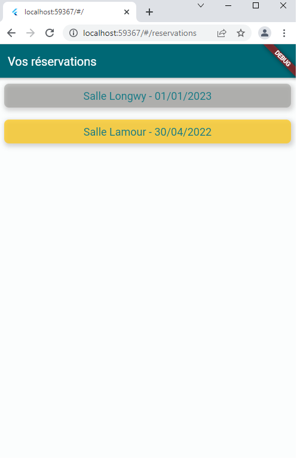

# PPE_M2L_mobile

Dans le contexte de la Maison des Ligues de Lorraine nous avons mis en place une application mobile de commande de services, disponible au cours d’une réunion, ainsi qu’un système permettant de valider la présence des participants ; ces-derniers pourront également se signaler COVID positif, en cas de besoin.

## Installation 

### Prérequis
Les logiciels ci-dessous sont nécessaires au fonctionnement de notre application, voici les commandes pour vérifier qu'ils sont bien installés sur votre système. Sinon, télécharger les et suivez les étapes d'installation depuis les liens mis à disposition.

* Git `git --version` ou télécharger et installer [Git](https://git-scm.com/downloads)
* VS Code ou télécharger et installer [VSCode](https://code.visualstudio.com/Download) 
* Suivez [les étapes d'installation](https://docs.flutter.dev/get-started/install) pour mettre en place votre environnement Flutter.

### Installation de l'application
Cloner le dépôt distant GitHub

`git clone https://github.com/BSevault/PPE_M2L_mobile.git`

## Lancement

Une fois les étapes d'installation effectuées, ouvrez le dossier `./PPE_M2L_mobile` dans VS Code.

Sélectionnez l'émulateur Chrome comme sur la capture d'écran ci-dessous

Pour lancer l'application ouvrez le fichier `./PPE_M2L_mobile/lib/main.dart` dans VS Code et faites `CTRL + F5`.

L'IDE va alors construire l'application et lancer Chrome.
Voici ce que vous devriez avoir :

### Test

Pour vérifier que l'application fonctionne bien, lancez notre API comme expliqué [ici](https://github.com/BSevault/PPE_M2L_backend/blob/develop/README.md)

Une fois lancé, connectez-vous avec un utilisateur que vous avez créé via l'interface web. Vous avez maintenant accés aux fonctionnalités de l'application mobile si le jour de la réservation de la salle correspond à la date du jour. 

Exemple, nous sommes le 30 avril j'ai donc accès à la salle Lamour car nous sommes le jour de la réunion.

